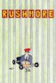
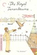
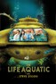
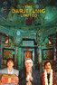
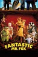
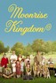
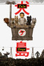

<!-- README.md is generated from README.Rmd. Please edit that file -->

# omdbr 

<!-- badges: start -->

[](https://github.com/inSileco/omdbr/actions)
[](https://www.tidyverse.org/lifecycle/#stable)
[](https://cran.r-project.org/package=omdbr)
[](https://www.gnu.org/licenses/gpl-3.0)
[](code_of_conduct.md)
[](https://insileco.r-universe.dev/ui#builds)
<!-- badges: end -->

The package `omdbr` is an R client to the [OMDb
API](http://www.omdbapi.com). User can retrieve informations about
movies (title, actors, year, genres, etc.) and download poster (if
available) using the [YTS API](https://yts.mx/api/v2/).

<br />

## Prerequisites

This package uses the [OMDb API](http://www.omdbapi.com) which requires
an **API Key**. You can freely obtain your own
[here](http://www.omdbapi.com/apikey.aspx). When you’ll use the package
`omdbr` for the first time, you’ll be guided on how to store your
personal API key.

<br />

## Installation

To install the `omdbr` package, run the following command:

``` r
remotes::install_github("inSileco/omdbr")
```

and load the package:

``` r
library(omdbr)
```

<br />

<p align="center">



</p>

<br />

## Example

> **Objective**: Getting informations and cover for [*The Darjeeling
> Limited*](https://imdb.com/title/tt0838221) movie directed by [Wes
> Anderson](https://en.wikipedia.org/wiki/Wes_Anderson).

<br />

**STEP 1**: Finding the IMDb identifier of the movie

The package `omdbr` uses the IMDb ID the retrieves informations and
cover movie. The function `find_imdb_id()` tries to find this ID.

``` r
x <- find_imdb_id("The Darjeeling Limited")
## ────────────────────────────────────────────────────────────────────────────────
## ℹ Searching 'The Darjeeling Limited' in movies title...
## ✔ 1 match found!
##   Returning the best match
## ────────────────────────────────────────────────────────────────────────────────
```

``` r
str(x)
## 'data.frame':    1 obs. of  3 variables:
##  $ title : chr "The Darjeeling Limited"
##  $ year  : chr "2007"
##  $ imdbid: chr "tt0838221"
```

    ##                    title year    imdbid
    ## 1 The Darjeeling Limited 2007 tt0838221

:bulb: The argument `year` can be used to reduce results.

<br />

:bulb: You can also find this ID by searching the movie title on the
[IMDb website](https://imdb.com) and extract it from the URL. The URL of
*The Darjeeling Limited* is: <https://imdb.com/title/tt0838221>.

<br />

**STEP 2**: Getting movie informations

To retrieve informations about the movie we will use the function
`get_details()`:

``` r
x <- get_details(imdb_id = "tt0838221")
```

    ## ────────────────────────────────────────────────────────────────────────────────
    ## 
    ## - imdbid: tt0838221
    ##   type: movie
    ##   title: The Darjeeling Limited
    ##   year: 2007.0
    ##   runtime: 91.0
    ##   director: Wes Anderson
    ##   writer:
    ##     - Wes Anderson
    ##     - Roman Coppola
    ##     - Jason Schwartzman
    ##   actors:
    ##     - Owen Wilson
    ##     - Adrien Brody
    ##     - Jason Schwartzman
    ##     - Amara Karan
    ##   genre:
    ##     - Adventure
    ##     - Comedy
    ##     - Drama
    ##   plot: A year after their father's funeral, three brothers travel across India by train
    ##     in an attempt to bond with each other.
    ##   language:
    ##     - English
    ##     - Hindi
    ##     - German
    ##     - Punjabi
    ##     - Tibetan
    ##     - French
    ##   country: USA
    ##   imdbrating: 7.2
    ##   slug: the-darjeeling-limited-2007
    ## 
    ## ────────────────────────────────────────────────────────────────────────────────

``` r
class(x)
## [1] "data.frame"
```

    ##      imdbid  type                  title year runtime     director
    ## 1 tt0838221 movie The Darjeeling Limited 2007      91 Wes Anderson
    ##                                           writer
    ## 1 Wes Anderson, Roman Coppola, Jason Schwartzman
    ##                                                      actors
    ## 1 Owen Wilson, Adrien Brody, Jason Schwartzman, Amara Karan
    ##                      genre
    ## 1 Adventure, Comedy, Drama
    ##                                                                                                                      plot
    ## 1 A year after their father's funeral, three brothers travel across India by train in an attempt to bond with each other.
    ##                                           language country imdbrating
    ## 1 English, Hindi, German, Punjabi, Tibetan, French     USA        7.2
    ##                          slug
    ## 1 the-darjeeling-limited-2007

:bulb: Results are stored in `data/tt0838221.yml` (path can be changed
by using the argument `path`).

<br />

If you want to get access to these data you can use the function
`read_details()`:

``` r
x <- read_details(imdb_id = "tt0838221")
## ────────────────────────────────────────────────────────────────────────────────
## 
## - imdbid: tt0838221
##   type: movie
##   title: The Darjeeling Limited
##   year: 2007.0
##   runtime: 91.0
##   director: Wes Anderson
##   writer:
##     - Wes Anderson
##     - Roman Coppola
##     - Jason Schwartzman
##   actors:
##     - Owen Wilson
##     - Adrien Brody
##     - Jason Schwartzman
##     - Amara Karan
##   genre:
##     - Adventure
##     - Comedy
##     - Drama
##   plot: A year after their father's funeral, three brothers travel across India by
##     train in an attempt to bond with each other.
##   language:
##     - English
##     - Hindi
##     - German
##     - Punjabi
##     - Tibetan
##     - French
##   country: USA
##   imdbrating: 7.2
##   slug: the-darjeeling-limited-2007
## 
## ────────────────────────────────────────────────────────────────────────────────
```

    ##      imdbid  type                  title year runtime     director
    ## 1 tt0838221 movie The Darjeeling Limited 2007      91 Wes Anderson
    ##                                           writer
    ## 1 Wes Anderson, Roman Coppola, Jason Schwartzman
    ##                                                      actors
    ## 1 Owen Wilson, Adrien Brody, Jason Schwartzman, Amara Karan
    ##                      genre
    ## 1 Adventure, Comedy, Drama
    ##                                                                                                                      plot
    ## 1 A year after their father's funeral, three brothers travel across India by train in an attempt to bond with each other.
    ##                                           language country imdbrating
    ## 1 English, Hindi, German, Punjabi, Tibetan, French     USA        7.2
    ##                          slug
    ## 1 the-darjeeling-limited-2007

<br />

**STEP 3**: Getting movie poster

Now, we can try to download the movie poster with the function
`get_cover()`:

``` r
get_cover(imdb_id = "tt0838221")
```

    ## ✔ Cover found for 'tt0838221' !

<br />

<p align="center">


</p>

<br />

:bulb: Results are stored as follow:

``` r
.
├── covers
│   └──tt0838221.jpg
└── data
    └──tt0838221.yml

2 directories, 2 files
```

<br />

## Code of Conduct

Please note that the `omdbr` project is released with a [Contributor
Code of
Conduct](https://contributor-covenant.org/version/2/0/CODE_OF_CONDUCT.html).
By contributing to this project, you agree to abide by its terms.
