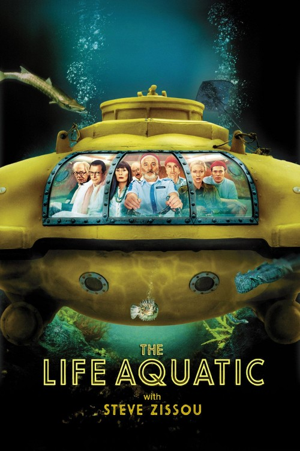

<!-- README.md is generated from README.Rmd. Please edit that file -->

# omdbr 

<!-- badges: start -->

[](https://github.com/inSileco/omdbr/actions)
<!-- badges: end -->

The package `omdbr` is an R client to the [OMDb
API](http://www.omdbapi.com). User can retrieve informations about a
given movie (title, actors, year, genres, etc.) and download movie
poster (if available).

<br />

## Installation

To install the `omdbr` package:

``` r
remotes::install_github("inSileco/omdbr")
```

<br />

## Prerequisites

This package uses the [OMDb API](http://www.omdbapi.com) to access data
on movies. You have to obtained an API key
[here](http://www.omdbapi.com/apikey.aspx). When using the package for
the first time, you’ll be guided to store your API key.

<br />

## Usage

``` r
library(omdbr)
```

Let’s get informations and cover about the [The Darjeeling
Limited](https://imdb.com/title/tt0838221) movie directed by [Wes
Anderson](https://en.wikipedia.org/wiki/Wes_Anderson). For the moment,
the package requires the IMDb Identifier of the movie. You can find this
ID by searching the movie on the [IMDb website](https://imdb.com) and
extract it from the URL (format: tt9999999).

The URL of *The Darjeeling Limited* is:
<https://imdb.com/title/tt0838221>, and the IMDb ID is: `tt0838221`.

``` r
imdb_id <- "tt0838221"             ## imdb id of the movie
path    <- "README_files/"         ## folder to store results
```

<br />

Let’s retrieve informations about the movie with the function
`get_details()`:

``` r
## Get informations about the movie ----
x <- get_details(imdb_id, path)
## ────────────────────────────────────────────────────────────────────────────────
## 
## - imdbid: tt0838221
##   type: movie
##   title: The Darjeeling Limited
##   year: 2007.0
##   runtime: 91.0
##   director: Wes Anderson
##   writer:
##     - Wes Anderson
##     - Roman Coppola
##     - Jason Schwartzman
##   actors:
##     - Owen Wilson
##     - Adrien Brody
##     - Jason Schwartzman
##     - Amara Karan
##   genre:
##     - Adventure
##     - Comedy
##     - Drama
##   plot: A year after their father's funeral, three brothers travel across India by train
##     in an attempt to bond with each other.
##   language:
##     - English
##     - Hindi
##     - German
##     - Punjabi
##     - Tibetan
##     - French
##   country: USA
##   imdbrating: 7.2
##   slug: the-darjeeling-limited-2007
## 
## ────────────────────────────────────────────────────────────────────────────────
```

<br />

Now, we can try to download the movie poster with the function
`get_cover()`:

``` r
## Download movie poster ----
get_cover(imdb_id, path)
## ✔ Cover found for 'tt0838221' !
```

<br />

What about [The Grand Budapest Hotel](https://imdb.com/title/tt2278388),
[The Life Aquatic with Steve Zissou](https://imdb.com/title/tt0362270),
and [Moonrise Kingdom](https://www.imdb.com/title/tt1748122)?

    ## ────────────────────────────────────────────────────────────────────────────────
    ## 
    ## - imdbid: tt2278388
    ##   type: movie
    ##   title: The Grand Budapest Hotel
    ##   year: 2014.0
    ##   runtime: 99.0
    ##   director: Wes Anderson
    ##   writer:
    ##     - Stefan Zweig
    ##     - Wes Anderson
    ##     - Wes Anderson
    ##     - Hugo Guinness
    ##   actors:
    ##     - Ralph Fiennes
    ##     - F. Murray Abraham
    ##     - Mathieu Amalric
    ##     - Adrien Brody
    ##   genre:
    ##     - Adventure
    ##     - Comedy
    ##     - Crime
    ##   plot: A writer encounters the owner of an aging high-class hotel, who tells him of
    ##     his early years serving as a lobby boy in the hotel's glorious years under an exceptional
    ##     concierge.
    ##   language:
    ##     - English
    ##     - French
    ##     - German
    ##   country:
    ##     - Germany
    ##     - USA
    ##   imdbrating: 8.1
    ##   slug: the-grand-budapest-hotel-2014
    ## 
    ## ────────────────────────────────────────────────────────────────────────────────
    ## ✔ Cover found for 'tt2278388' !
    ## 
    ## ────────────────────────────────────────────────────────────────────────────────
    ## 
    ## - imdbid: tt0362270
    ##   type: movie
    ##   title: The Life Aquatic with Steve Zissou
    ##   year: 2004.0
    ##   runtime: 119.0
    ##   director: Wes Anderson
    ##   writer:
    ##     - Wes Anderson
    ##     - Noah Baumbach
    ##   actors:
    ##     - Bill Murray
    ##     - Owen Wilson
    ##     - Cate Blanchett
    ##     - Anjelica Huston
    ##   genre:
    ##     - Action
    ##     - Adventure
    ##     - Comedy
    ##     - Drama
    ##     - Romance
    ##   plot: With a plan to exact revenge on a mythical shark that killed his partner, Oceanographer
    ##     Steve Zissou (Bill Murray) rallies a crew that includes his estranged wife, a journalist,
    ##     and a man who may or may not be his son.
    ##   language:
    ##     - English
    ##     - Icelandic
    ##     - Filipino
    ##     - Portuguese
    ##     - French
    ##     - Tagalog
    ##     - German
    ##     - Italian
    ##   country: USA
    ##   imdbrating: 7.3
    ##   slug: the-life-aquatic-with-steve-zissou-2004
    ## 
    ## ────────────────────────────────────────────────────────────────────────────────
    ## ✔ Cover found for 'tt0362270' !
    ## 
    ## ────────────────────────────────────────────────────────────────────────────────
    ## 
    ## - imdbid: tt1748122
    ##   type: movie
    ##   title: Moonrise Kingdom
    ##   year: 2012.0
    ##   runtime: 94.0
    ##   director: Wes Anderson
    ##   writer:
    ##     - Wes Anderson
    ##     - Roman Coppola
    ##   actors:
    ##     - Bruce Willis
    ##     - Edward Norton
    ##     - Bill Murray
    ##     - Frances McDormand
    ##   genre:
    ##     - Comedy
    ##     - Drama
    ##     - Romance
    ##   plot: A pair of young lovers flee their New England town, which causes a local search
    ##     party to fan out to find them.
    ##   language: English
    ##   country: USA
    ##   imdbrating: 7.8
    ##   slug: moonrise-kingdom-2012
    ## 
    ## ────────────────────────────────────────────────────────────────────────────────
    ## ✔ Cover found for 'tt1748122' !

<br />

<p align="center">



</p>

<br />

Results are stored as follow:

``` r
README_files
├── covers
│   ├── tt0362270.jpg
│   ├── tt0838221.jpg
│   ├── tt1748122.jpg
│   └── tt2278388.jpg
└── data
    ├── tt0362270.yml
    ├── tt0838221.yml
    ├── tt1748122.yml
    └── tt2278388.yml

2 directories, 8 files
```

<br />

Let’s import informations on these four movies:

``` r
## Read Movies Details ----
movies <- read_details(path)

movies[ , c("imdbid", "title", "year", "runtime", "imdbrating")]
##      imdbid                              title year runtime imdbrating
## 1 tt0362270 The Life Aquatic with Steve Zissou 2004     119        7.3
## 2 tt0838221             The Darjeeling Limited 2007      91        7.2
## 3 tt1748122                   Moonrise Kingdom 2012      94        7.8
## 4 tt2278388           The Grand Budapest Hotel 2014      99        8.1
```

<br />

:construction\_worker: **This package is still under development and
some other goodies will be available soon\!**
